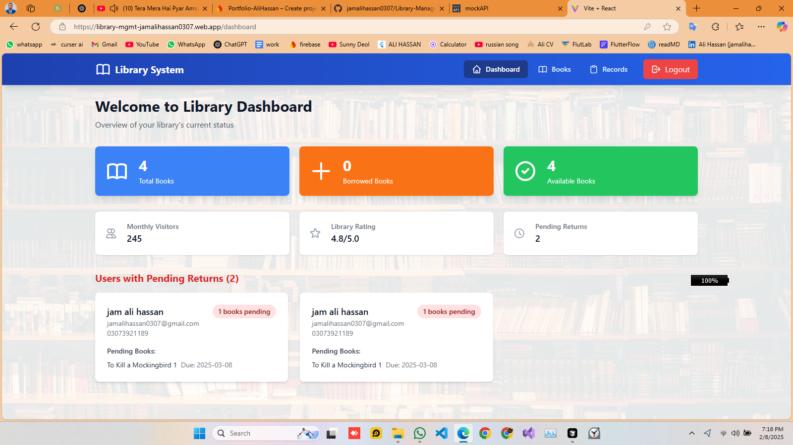
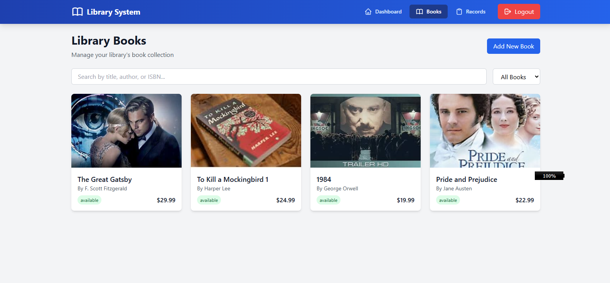
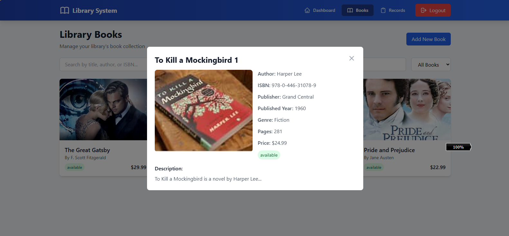
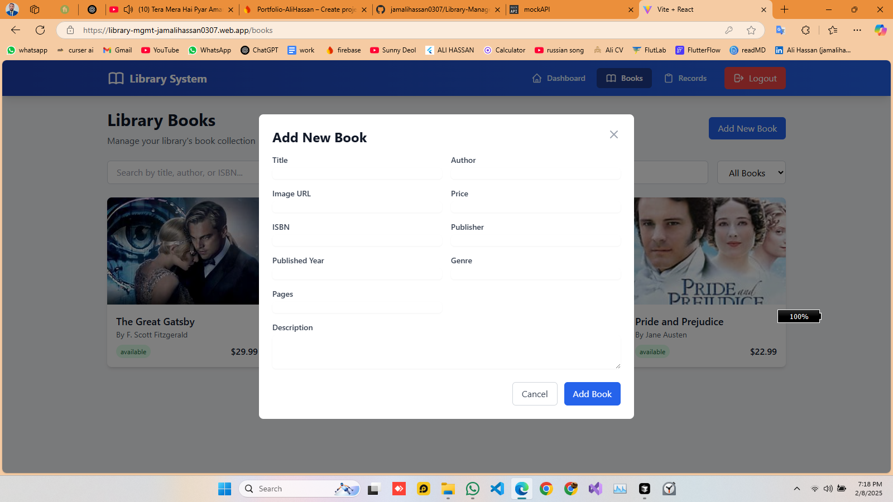
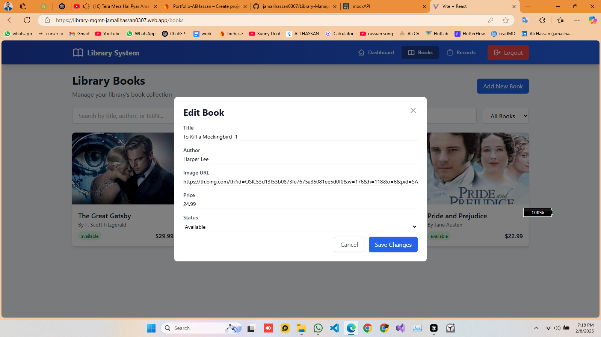
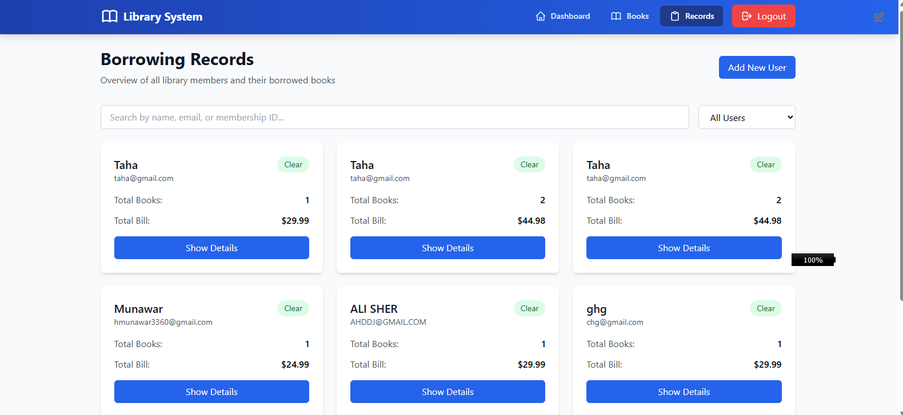
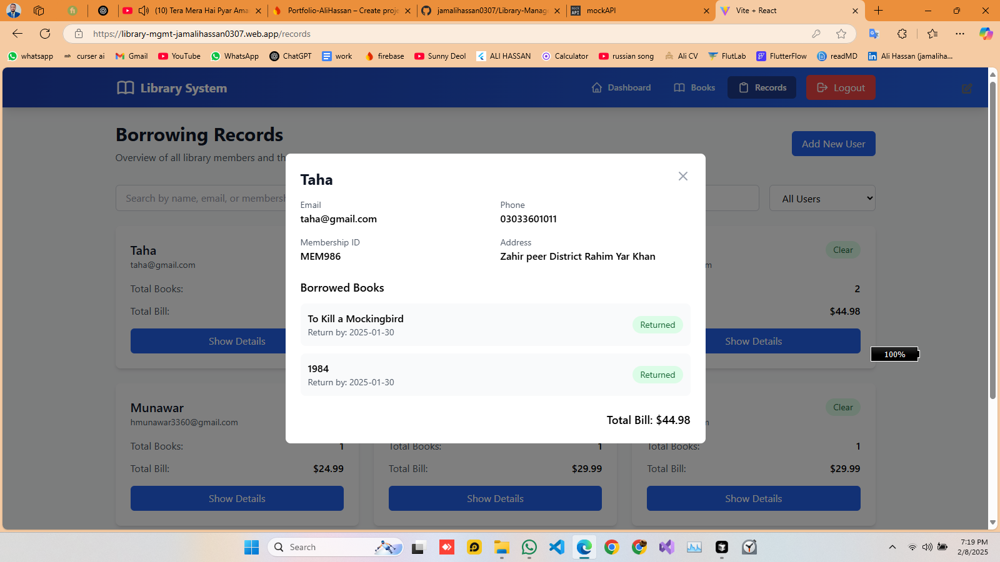
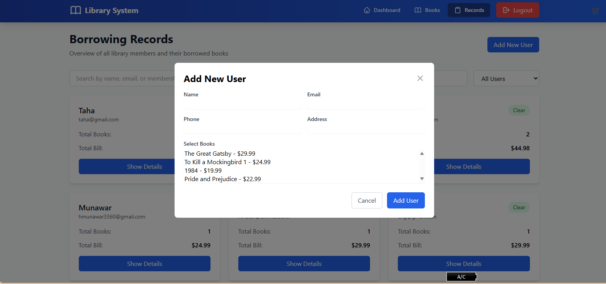
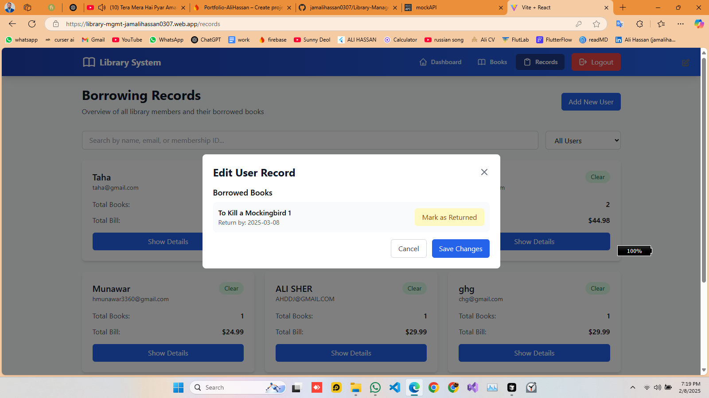

# Library Management System

A modern web application for managing library operations, built with React and Firebase. This system helps librarians manage books, track borrowing records, and handle user accounts efficiently.

## 🔴 Live Demo

Check out the live demo: [https://library-mgmt-jamalihassan0307.web.app](https://library-mgmt-jamalihassan0307.web.app)

## 📸 Screenshots

### Login Page

_Secure Authentication System_

### Dashboard

_Comprehensive Library Statistics and Overview_

### Books Management

_Books Collection Management_

_Detailed Book Information View_

_Add New Book Interface_

_Edit Book Details_

### Records Management

_Borrower Records Management_

_Detailed Borrower Information_

_Add New Borrower Record_

_Edit Borrower Details_

## 🚀 Features

### Authentication

- Secure Login System
- Role-based Access Control
- Session Management

### Dashboard

- Library Statistics Overview
- Track Total Books
- Monitor Borrowed/Available Books
- View Monthly Statistics
- Track Pending Returns

### Books Management

- Add/Edit/Delete Books
- Search & Filter Books
- Book Status Tracking
- Detailed Book Information

### Records Management

- User Borrowing History
- Return Book Processing
- User Management
- Detailed User Records

## 🛠️ Technologies Used

- React 18
- Vite
- Firebase Hosting
- React Router DOM
- Tailwind CSS
- Local Storage for data persistence

## ⚙️ Installation & Deployment

1. Clone and Install:

- Clone the repository: `git clone https://github.com/jamalihassan0307/library-management-system.git`
- Navigate to the project directory: `cd library-management-system`
- Install the dependencies: `npm install`
- Start the development server: `npm run dev`

2. Deployment:

- Build the project: `npm run build`
- Deploy the project to Firebase: `firebase deploy`

3. Firebase Configuration:

- Ensure you have the Firebase CLI installed: `npm install -g firebase-tools`
- Login to your Firebase account: `firebase login`
- Set the correct project: `firebase use --add`
- Deploy the project: `firebase deploy`

4. Firebase Hosting:

- The project is deployed to Firebase Hosting. You can access it at the URL provided in the deployment logs.

## 🔑 Login Credentials

- Email: demo@gmail.com
- Password: 1234

## 🙏 Acknowledgments

- [React](https://reactjs.org/)
- [Vite](https://vitejs.dev/)
- [Firebase](https://firebase.google.com/)
- [Tailwind CSS](https://tailwindcss.com/)
- [React Router](https://reactrouter.com/)

## 📝 License

This project is licensed under the MIT License - see the [LICENSE](LICENSE) file for details.
